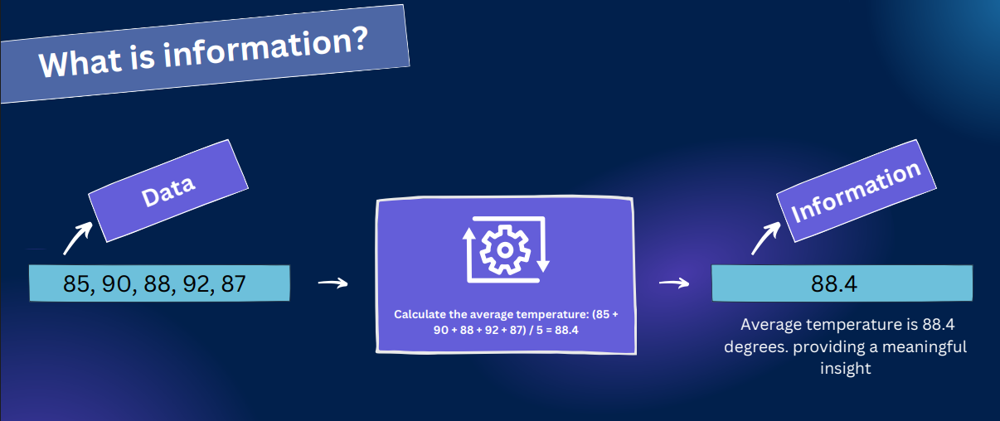
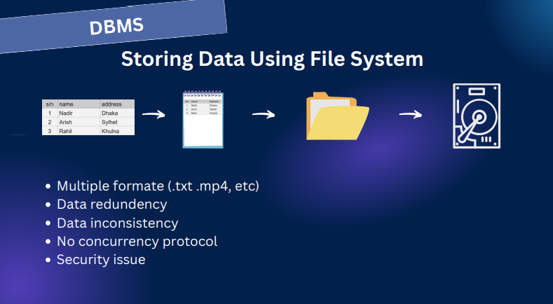
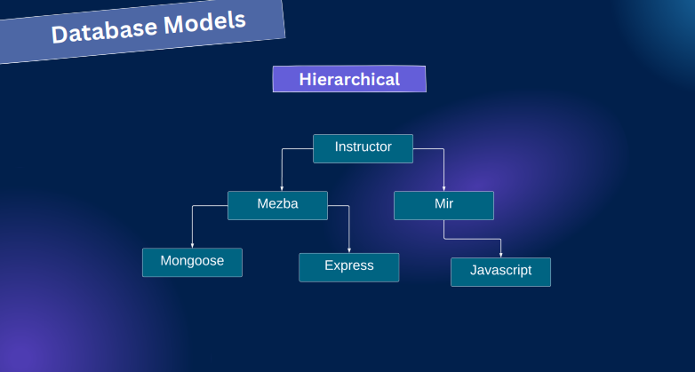
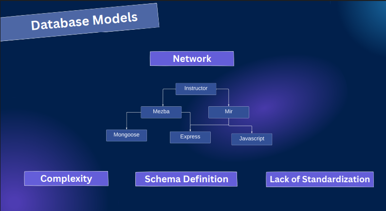
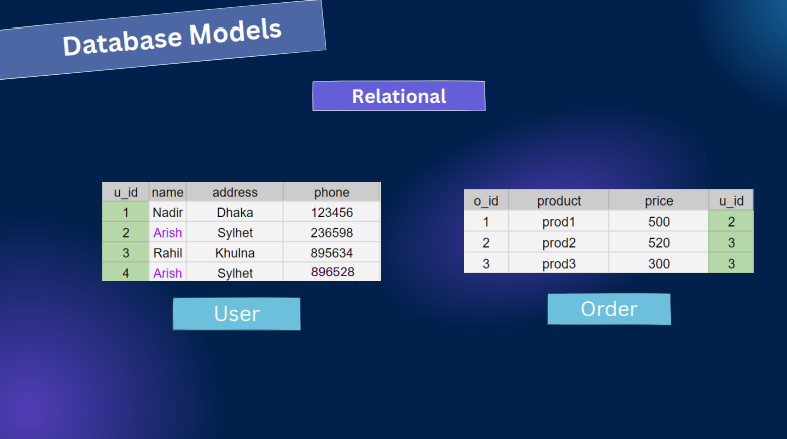
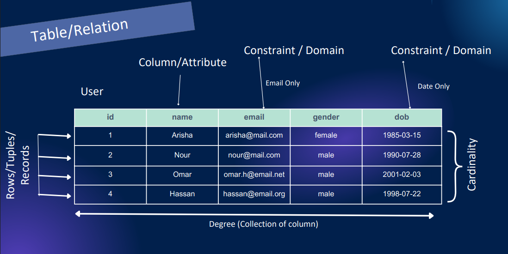
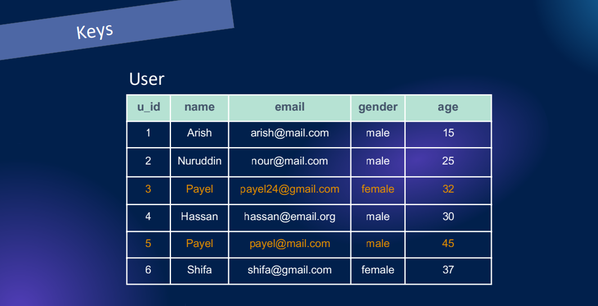
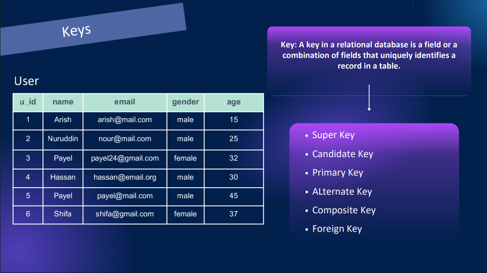
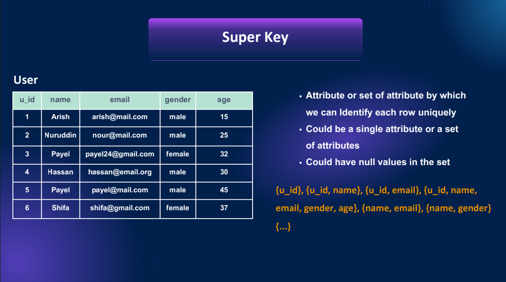

# RDBMS RECAP-1
Slide Link: https://drive.google.com/file/d/1T5ZsbQibyIerI-MiOtVjZVh4STQuXf73/view?usp=drive_link

In this module, you’ll learn the foundations of databases and the relational model. We’ll cover data vs. information, database models, tables, and different types of keys. You’ll also explore the database design process with ER diagrams and relationship cardinality—equipping you with the skills to design efficient relational databases.

## 42-1 Database and data vs information
- A database is a structured collection of related data, organized for efficient storage, retrieval, and management.
- data Is Everywhere and Data Is Everything. Data is heart of a application 

### What is Data ?
- Data is a fact that can be recorded in form of any format. 

### What is Information?
- Information is processed and organized data that provides meaningful context, insight or knowledge. 

## 42-2 Why File Systems Fail
- Full Form of dbms is database management system 

### How Do we Store Data Using File System? 
- We could use file system to store the data as well instead of database 
    1. We have Multiple formate data (.txt.mp4, etc). Combining these all and work will be a hassle because we have to make different program to grab information we need a specific system. 
    2. Data Redundancy (data duplication) problem will appear
    3. Data Inconsistency will appear
    4. No Concurrency Protocol (there is no fixed rules like which works will be done first)
    5. There will be security issue (Either we have to give full access to a user or none)

### For Solving the drawback of the file system dbms came 
- Dbms take all the responsibilities for managing data 

#### Popular database management system 
- `Relational` - Mysql, postgresql, sqlite, sql server
- `Document` - Mongodb, Dynamodb
- `Key value` - Redis 

## 42-3 Types of Database Models
### Models 
- Hierarchical
- Network
- Relational
- Document
- Key value 

#### Hierarchical Model 
- It is used to create tree of parent child(node) 
- The main problem of the model was one child(node) can not have multiple parent 

#### Network Model
- The problem of Hierarchical Model  was solved in Network Model 
- Here a node or child can have multiple parents 
- The problems of the model was like it was `Complex`, has no `Schema Definition`, and has `Lack Of Scandalization`

#### Relational Model
- All the problems of Network model and Hierarchical Model were solved by relational model 
- Data is stored in `table format` here 

- We could do searching using the unique key and indexing 

## 42-4 The anatomy of a table or relation
- In relation model data is stored in table format and these tables are called relations which means real life/ imaginary entity. 
- Each row of the table are called `ROWS/RECORDS/TUPLES`
- Combination of the rows or all the rows combined are called `cardinality`
- Each columns are called `Column/Attribute`. We can set fixed type to a column like email or dob these are called `constraint/domain`
- All the Columns are called all together `Degree/Collection of Columns` 

## 42-5 Keys in Databases: Super key

- In here u_id is a key 
- combining u_id and name can be also a key 

### What is Key ?

- A key ina  relational database is a field or a combination of fields that uniquely Identifies a record in a table. 

- there different kind of key 
    1. Super key
    2. Candidate Key 
    3. Primary Key
    4. Alternate Key 
    5. Composite Key 
    6. Foreign Key 

#### Super key 

- Attributes or set of Attributes by which we can identify each row uniquely 
- Could be a single attribute or a set of attribute 
- Could have null values in the set 

- primary key combination will be single or multiple {u_id},  {u_id, name},  {u_id, email}, {u_id, name,
email, gender, age}, {name, email}, {name, gender}
{...}. The main purpose is to identify uniquely 

## 42-6 Candidate Keys, Subsets & Proper Subsets Explained

